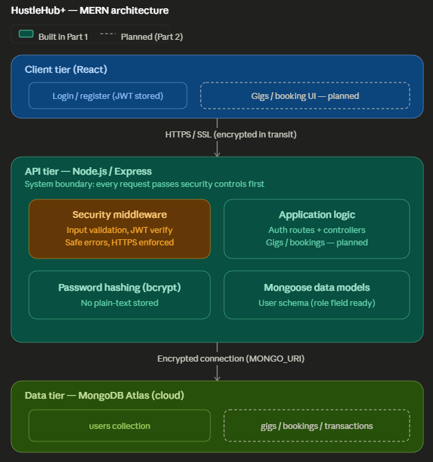

# HustleHub+ — Secure Freelance Marketplace

INSY7314 / APDS7311 Portfolio of Evidence — Group Project

HustleHub+ is a secure freelance marketplace platform that allows freelancers to
advertise services (gigs) and clients to browse and book them. It records simulated
financial transactions and gives freelancers an indication of income earned and
estimated tax obligations. Security is treated as a primary concern throughout.

> **Part 1 scope:** secure backend foundations — registration, login, JWT-protected
> routes, HTTPS, input validation, and safe error handling.

---

## Table of Contents
- [System Overview](#system-overview)
- [Architecture](#architecture)
- [Security Decisions](#security-decisions)
- [Project Structure](#project-structure)
- [Getting Started](#getting-started)
- [API Endpoints](#api-endpoints)
- [Testing (Postman)](#testing-postman)
- [Team & Contributions](#team--contributions)
- [Demonstration Video](#demonstration-video)

---

## System Overview
<!-- OWNER: Member C -->
_TODO: Describe the system, its intended users (Clients, Freelancers, Admin),
and what the backend does. Keep it clear and professional._

## Architecture


*Figure 1: HustleHub+ system architecture. Solid components are implemented in Part 1; dashed components are planned for Part 2. Security controls sit at the API boundary — every request passes validation and JWT verification before reaching application logic.*
<!-- OWNER: Member C -->
_TODO: Insert the MERN architecture diagram (image) showing components, security
features, and system boundaries. Explain the request flow: client → HTTPS →
Express → middleware (validate, auth) → controller → MongoDB._

## Security Decisions
<!-- OWNERS: Member A (hashing, JWT) + Member B (HTTPS, validation, errors) -->
This section carries significant marks — explain **why**, not just what.

### Password Hashing
<!-- Member A -->
_TODO: Explain bcrypt, salting, why plain-text is never stored._

### Token-Based Authentication (JWT)
<!-- Member A -->
_TODO: Explain the JWT flow, what the payload contains (id, role), how the secret
is kept out of source control, and how protected routes are validated._

### Input Validation
<!-- Member B -->
_TODO: Explain how input is validated/rejected before processing._

### HTTPS
<!-- Member B -->
_TODO: Explain HTTPS/SSL, why it matters, and how it is configured locally._

### Secure Error Handling
<!-- Member B -->
_TODO: Explain how errors avoid leaking stack traces / paths / config._

## Project Structure
```
api/
├── src/
│   ├── config/       # DB connection
│   ├── models/       # Mongoose schemas (User)
│   ├── controllers/  # Request handlers (auth)
│   ├── routes/       # Express routers
│   ├── middleware/   # auth (JWT), validate, errorHandler
│   └── utils/        # logger
├── ssl/              # local SSL cert (gitignored)
├── tests/            # unit tests (Part 2)
└── server.js         # HTTPS entry point
client/               # React frontend (Part 2)
```

## Getting Started
<!-- OWNER: Member D -->

### Prerequisites
- Node.js (LTS) and npm
- A MongoDB Atlas connection string
- Git

### Setup
```bash
# 1. Clone and enter the API
cd api

# 2. Install dependencies
npm install

# 3. Create your local .env from the template
cp .env.example .env
#    then edit .env with your real MONGO_URI and JWT_SECRET

# 4. Generate a local SSL certificate (self-signed) into api/ssl/
#    (run once; certs are gitignored)
#    openssl req -x509 -newkey rsa:2048 -nodes \
#      -keyout ssl/key.pem -out ssl/cert.pem -days 365 \
#      -subj "/CN=localhost"

# 5. Run the server
npm run dev
```

### Code quality (linting & formatting)
This project uses ESLint + Prettier for consistent code style across the team.
```bash
npm run lint       # report issues
npm run lint:fix   # auto-fix what it can
npm run format     # apply Prettier formatting
```
Run these before opening a pull request so diffs show real changes, not style noise.

> **Node version:** the team baseline is Node 20 LTS (see `.nvmrc`). Newer
> versions work, but if you hit a package issue, align with `nvm use`.

_TODO (Member D): confirm these steps on a clean machine and add a note on
generating a strong JWT_SECRET, e.g.:_
`node -e "console.log(require('crypto').randomBytes(48).toString('hex'))"`

## API Endpoints
<!-- OWNER: Member A -->
| Method | Endpoint            | Description                | Auth |
|--------|---------------------|----------------------------|------|
| GET    | /health             | Server health check        | No   |
| POST   | /api/auth/register  | Register a new user        | No   |
| POST   | /api/auth/login     | Log in, receive a JWT      | No   |

_TODO: Add request/response body examples once implemented._

## Testing (Postman)
<!-- OWNER: Member D -->
_TODO: Describe the Postman collection (in /postman), covering successful
registration and login plus invalid scenarios. Add screenshots of responses._

## Team & Contributions
<!-- OWNER: everyone — fill in your name + student number + your slice -->
| Member | Student No. | Responsibility |
|--------|-------------|----------------|
| _Name_ | _______ | Auth & Security core (hashing, JWT, protected routes) |
| _Name_ | _______ | HTTPS, validation, error handling |
| _Name_ | _______ | Data layer, DB config, architecture diagram |
| _Name_ | _______ | Testing, Postman, README assembly, DevOps |

## Demonstration Video
<!-- OWNER: Member D -->
_TODO: Add the unlisted video link showing the API running, registration, and
login with token generation._
